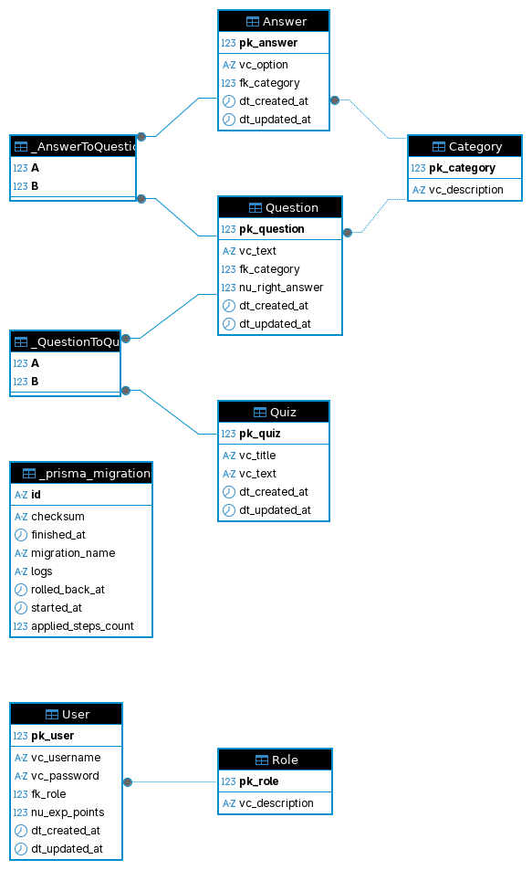

# Quiz Sistema

Sistema de quizzes sobre países e continentes com pontos de experiência, com NestJS e Prisma ORM com PostgreSQL no backend, e React no frontend.

# Diagrama ER

# Instruções

Baixar o repositório com os arquivos do projeto usando `git clone`;

## Backend
1. Entrar no diretório `backend`;
1. Executar o comando `docker compose up -d` para criar e rodar o container de banco de dados;
1. Copiar o arquivo `.env.example` para `.env` e alterar as configurações;
1. Executar o comando `docker build -t quiz-sistema-backend -f Dockerfile-nestjs .` para criar o container de backend;
1. Executar o comando `docker run -d -p 3000:3000 quiz-sistema-backend` para rodar o container.

## Frontend
1. Entrar no diretório `frontend`;
1. Copiar o arquivo `.env.example` para `.env` e alterar as configurações;
1. Executar o comando `docker build -t quiz-sistema-frontend -f Dockerfile-react .` para criar o container de frontend;
1. Executar o comando `docker run -d -p 3001:3001 quiz-sistema-frontend` para rodar o container.
